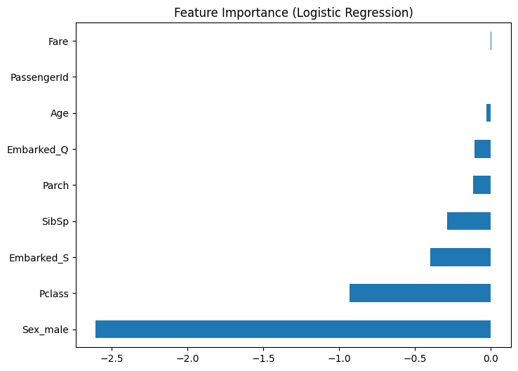

# Titanic Survival Prediction 🚢

This project predicts whether a passenger survived the Titanic disaster using machine learning.

## Steps:
- Data Cleaning
- Feature Engineering
- Logistic Regression
- Decision Tree
- Model Evaluation

## Dataset:
Source: Kaggle Titanic Dataset

## Tools:
- Python
- Pandas
- Scikit-learn
- Seaborn
- Matplotlib

## Results:
The model achieved around 78–82% accuracy on validation data.

This project is part of my Data Science portfolio.
